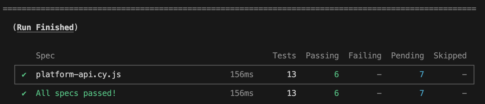

# WhisperChain+ API

Anonymous Messaging with Role-Based Control and Accountability

## Overview

WhisperChain+ is a secure messaging system that allows users to send anonymous messages in designated rounds while maintaining accountability through role-based access control.

## Features

- **Role-Based Access Control**: Different user roles (Sender, Recipient, Moderator, Admin) with specific permissions
- **Anonymous Messaging**: Users can send encrypted messages anonymously during open rounds
- **One-Time Use Tokens**: Each user gets a unique token per round that can only be used once
- **End-to-End Encryption**: Messages are encrypted with the recipient's public key
- **Audit Logs**: All system actions are logged for accountability while preserving anonymity
- **Moderation Tools**: Moderators can review flagged messages and freeze abusive tokens

## System Architecture

The system uses:
- Node.js and Express for the backend API
- MongoDB for data storage
- JWT for authentication
- bcrypt for password hashing

## API Endpoints

### Admin Routes
- `POST /whisperchain/admin/setup`: Create the initial admin account
- `POST /whisperchain/admin/login`: Admin login
- `POST /whisperchain/admin/assignRole`: Assign a role to a user
- `POST /whisperchain/admin/startRound`: Start a new messaging round
- `POST /whisperchain/admin/endRound`: End the current messaging round
- `GET /whisperchain/admin/pendingUsers`: Get users waiting for role assignment

### Auth Routes
- `POST /whisperchain/auth/register`: Register a new user
- `POST /whisperchain/auth/login`: User login
- `POST /whisperchain/auth/generateKeyPair`: Store a user's public key
- `GET /whisperchain/auth/searchUsers`: Search for users by name

### Message Routes
- `POST /whisperchain/messages/send`: Send an encrypted message
- `GET /whisperchain/messages`: Get messages for a recipient
- `POST /whisperchain/messages/flag`: Flag a message for moderation

### Moderator Routes
- `GET /whisperchain/moderator/flaggedMessages`: Get flagged messages
- `POST /whisperchain/moderator/freezeToken`: Freeze a token
- `GET /whisperchain/moderator/auditLogs`: View audit logs

## Running the API

1. Install dependencies: `npm install`
2. Set up environment variables in `.env` file:
   ```
   MONGODB_URI=your_mongodb_connection_string
   JWT_SECRET=your_jwt_secret_key
   PORT=9090
   ```
3. Start the development server: `npm start`
4. For production: `npm run build` then `npm run prod`

## Security Features

- Passwords are hashed with bcrypt and salted
- Authentication uses JWT tokens
- Messages are encrypted end-to-end
- One-time use tokens prevent replay attacks
- Role separation ensures least privilege principles
- Audit logs provide accountability without compromising anonymity

## Created By

Jacob Zhang and Cameron Keith for CS55: Security & Privacy

# Lab 5: API Server

*description*
- create the API server to power our frontend notes app

[deployed url](https://platform-api-ckeith26.onrender.com/api)

## What Worked Well
- passed all tests

## What Didn't

## Extra Credit
- [X] change your tags store to be an array rather than a string, can just split by whitespace

## Screenshots


# starter express app template

* node with babel
* expressjs
* airbnb eslint rules

Procfile for Heroku included
Settings for render.com:
* build command:  `npm install && npm run build`
* run command:  `npm run prod`

### Sources
- used github copilot for debugging
